# Members API

api specs for sahl.io members subsystem prepared by Mohammed Almassri on 18-Dec-2022

updated 15-Apr-2023

## Requires Subscription

if any request returns with status code `426` it means that it is not allowed because the user is not subscribed and should be redirected to the choose subscription page

```json
{
  "status": 426,
  "code": 0,
  "locale": "ar",
  "message": "يجب التسجيل لاستخدام هذه الخدمة",
  "data": null
}
```


## Logout Warning

users are not allowed to use the same account on multiple devices. if they do, a warning message will appear in any request the send. it will look like this

```json
{
    "status": ...,
    "code": ...,
    "locale": ...
    "message": ...,
    "data": ...,
     "warning": {
        "session_id": 3277185,
        "message": "سوف يتم الخروج من الحسابات الأخرى",
        "time": "2023-04-16 00:31:56",// the time that this session will be logged out
        "agents": {
            //session_id: user_agent
            //you will use the session id in logoutOtherSessions
            "3277186": "Mozilla/5.0 (Windows NT 10.0; Win64; x64) AppleWebKit/537.36 (KHTML, like Gecko) Chrome/111.0.0.0 Safari/537.36",
            "3277185": "PostmanRuntime/7.30.0"
        }
    }
}
```

you will then need to show the user a list of devices and they can choose which one they don't want to log out from using `logoutOtherSessions`

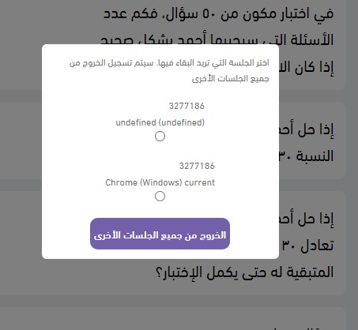

## subscription types

`GET` /api/members/subscriptionTypes

lists the subscription types a user can purchase

### example response

```json
[
        {
            "id": 1,
            "title": "اسبوعي",
            "description": "<p>اسبوعي</p>",
            "sub_item": {
                "id": 1,
                "title": "اختبارات",
                "description": "<p>اختبارات</p>"
            },
            "duration": 7,
            "has_trial": 0,
            "trial_duration": null,
            "price": "10.00", // the original price
            "current_price": "10.00", // the current price, can change if there is a sale
            "sale": null //no sale
        },
        {
            "id": 2,
            "title": "شهري",
            "description": "<p>شهري</p>",
            "sub_item": {
                "id": 1,
                "title": "اختبارات",
                "description": "<p>اختبارات</p>"
            },
            "duration": 30,
            "has_trial": 1,//ignore trials for now as they are not complete yet
            "trial_duration": 30,
            "price": "35.00",
            "current_price": "26.25",
            "sale": { // is on sale, this is why the price is different from the current price
                "id": 3,
                "title": "تخفيض عيد الفطر",
                "start_date": "2022-04-01 00:00:00",
                "end_date": "2023-05-16 00:00:00",//sale valid until
                "sale_pct": 0.25
            }
        }
    ],

```

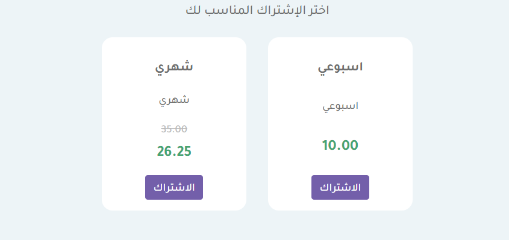

## payment details

`GET` /api/members/subscriptionTypes/`{sub_type_id}`/paymentDetails

gets the payment details for a specific subscription type

### params

<table>
<tr>
<th>code</th>
<td>(optional) coupon code</td>
</tr>
</table>

### example response

response when there's a sale

```json
[
  {
    "id": null,
    "amount": "35.00",
    "type": 1,
    "notes": null,
    "source_type": 1,
    "title": "العملية"
  },
  {
    "id": null,
    "amount": "3.68",
    "type": 1,
    "notes": null,
    "source_type": 2,
    "title": "الضريبة"
  },
  {
    "id": null,
    "amount": "8.75",
    "type": 4,
    "notes": null,
    "source_type": 4,
    "title": "تخفيض"
  }
]
```

to calculate the total, get the sum of type 1 minus the sum of type 4

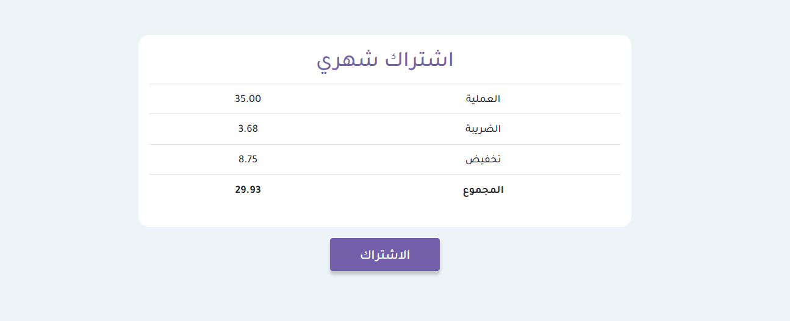

response when there's a coupon

```json
[
        {
            "id": null,
            "amount": "10.00",
            "type": 1,
            "notes": null,
            "source_type": 1,
            "title": "العملية"
        },
        {
            "id": null,
            "amount": "1.12",
            "type": 1,
            "notes": null,
            "source_type": 2,
            "title": "الضريبة"
        },
        {
            "id": null,
            "amount": "2.00",
            "type": 4,
            "notes": null,
            "source_type": 3,
            "title": "كوبون"
        }
    ],
```


## check coupon

`GET` /api/members/coupons/check

used to check if the coupon is valid

### params

<table>
<tr>
<th>code</th>
<td>coupon code</td>
</tr>
</table>

### example response

response when not valid

```json
{
  "status": 404,
  "code": 0,
  "locale": "ar",
  "message": "الكوبون غير موجود او غير فعال",
  "data": null,
  "errors": null,
  "exception": null,
  "export": null
}
```

response when valid

```json
{
  "status": 200,
  "code": 0,
  "locale": "ar",
  "message": "OK",
  "data": {
    "id": 2,
    "code": "SAHL-2000",
    "pct": "0.20",
    "start_date": "2022-12-18 00:00:00",
    "end_date": "2023-12-31 00:00:00"
  },
  "errors": null,
  "exception": null,
  "export": null
}
```

## pay

`POST` /members/subscriptionTypes/`{sub_type_id}`/pay

this will return a url but i'm not sure if it will work on mobile, leave it for now

## subscriptions

`GET` /api/members/subscriptions

get the user's previous subscriptions

## transactions

`GET` /api/members/transactions

get the user's previous transactions

## invoices

`GET` /api/members/invoices

get the user's previous invoices

## category

`GET` /api/members/categories/`{category_id}`

gets the category and all it's children.

### example response

the response is too large so I will break it up into parts

```json
{
    "status": 200,
    "code": 0,
    "locale": "ar",
    "message": "OK",
    "data": {
        "id": 45,
        "title": "لفظي",
        "full_title": "قدرات / لفظي",
        "teachers": [
            {
                "id": 2021695,
                "name": "ياسين رمضان",
                "image": null,
                "expl_duration": "13:19:50",
                "explanations": []
            },
            {
                "id": 2028265,
                "name": "السيد جاد الله",
                "image": "75102dd4-e718-40ca-b5f3-37a2df2836e2",
                "expl_duration": "8:59:46",
                "explanations": []
            }
        ],
        "has_questions": true,
        "parents": [
            4
        ],
        "children": [
            {
                "id": 46,
                "title": "التناظر اللفظي",
                "full_title": "قدرات / لفظي / التناظر اللفظي",
                "has_questions": true,
                "parents": [
                    4,
                    45
                ],
                "explanation_completion": {
                    "2021695": {
                        "teacher_id": "2021695",
                        "completed": 2,
                        "total": 6
                    },
                    "2028265": {
                        "teacher_id": "2028265",
                        "completed": 0,
                        "total": 6
                    }
                }
            },
            {
                "id": 76,
                "title": "استيعاب المقروء",
                "full_title": "قدرات / لفظي / استيعاب المقروء",
                "has_questions": true,
                "parents": [
                    4,
                    45
                ],
                "explanation_completion": {
                    "2021695": {
                        "teacher_id": "2021695",
                        "completed": 1,
                        "total": 9
                    },
                    "2028265": {
                        "teacher_id": "2028265",
                        "completed": 0,
                        "total": 4
                    }
                }
            },
            {
                "id": 77,
                "title": "إكمال الجمل",
                "full_title": "قدرات / لفظي / إكمال الجمل",
                "has_questions": true,
                "parents": [
                    4,
                    45
                ],
                "explanation_completion": {
                    "2028265": {
                        "teacher_id": "2028265",
                        "completed": 0,
                        "total": 4
                    },
                    "2021695": {
                        "teacher_id": "2021695",
                        "completed": 6,
                        "total": 6
                    }
                }
            },
            {
                "id": 78,
                "title": "الخطأ السياقي",
                "full_title": "قدرات / لفظي / الخطأ السياقي",
                "has_questions": true,
                "parents": [
                    4,
                    45
                ],
                "explanation_completion": {
                    "2021695": {
                        "teacher_id": "2021695",
                        "completed": 0,
                        "total": 4
                    },
                    "2028265": {
                        "teacher_id": "2028265",
                        "completed": 0,
                        "total": 4
                    }
                }
            },
            {
                "id": 79,
                "title": "الارتباط والاختلاف",
                "full_title": "قدرات / لفظي / الارتباط والاختلاف",
                "has_questions": true,
                "parents": [
                    4,
                    45
                ],
                "explanation_completion": {
                    "2021695": {
                        "teacher_id": "2021695",
                        "completed": 0,
                        "total": 1
                    },
                    "2028265": {
                        "teacher_id": "2028265",
                        "completed": 0,
                        "total": 2
                    }
                }
            },
            {
                "id": 132,
                "title": "المفردة الشاذة",
                "full_title": "قدرات / لفظي / المفردة الشاذة",
                "has_questions": true,
                "parents": [
                    4,
                    45
                ],
                "explanation_completion": []
            },
            {
                "id": 133,
                "title": "الاختبارات",
                "full_title": "قدرات / لفظي / الاختبارات",
                "has_questions": true,
                "parents": [
                    4,
                    45
                ],
                "explanation_completion": {
                    "2021695": {
                        "teacher_id": "2021695",
                        "completed": 1,
                        "total": 3
                    }
                }
            }
        ],
        "explanation_completion": {
            "2021695": {
                "teacher_id": "2021695",
                "completed": 10,
                "total": 29
            },
            "2028265": {
                "teacher_id": "2028265",
                "completed": 0,
                "total": 20
            }
        }
    },
    "errors": null,
    "exception": null,
    "export": null
}
```

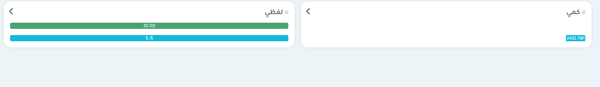

this is the results from `category_id` = 4

note that the green bar is the `division_completion` and the blue bar is the `question_completion`

each child can have children and those children can have children and so on...

this is what it looks like

children level 1
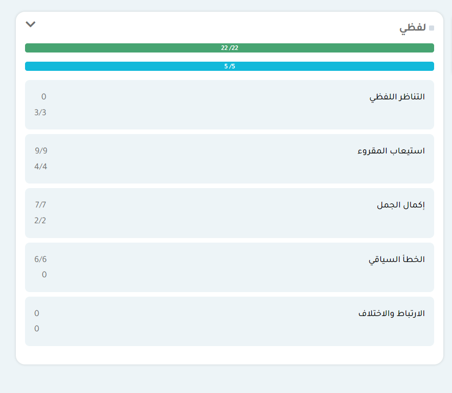

children level 2
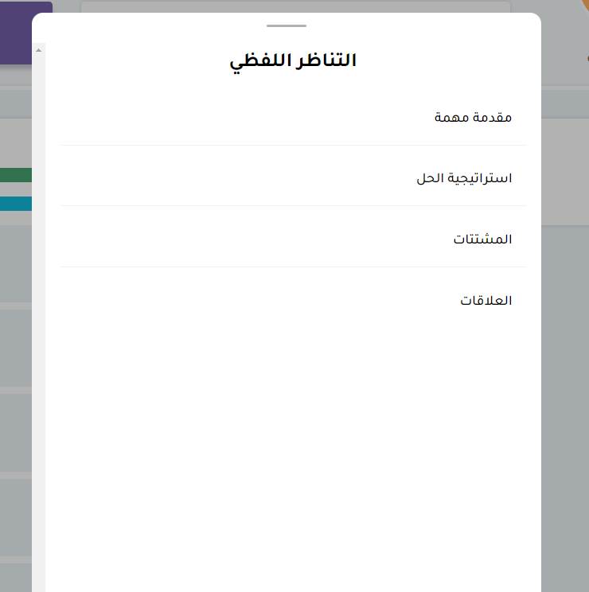

children level 3
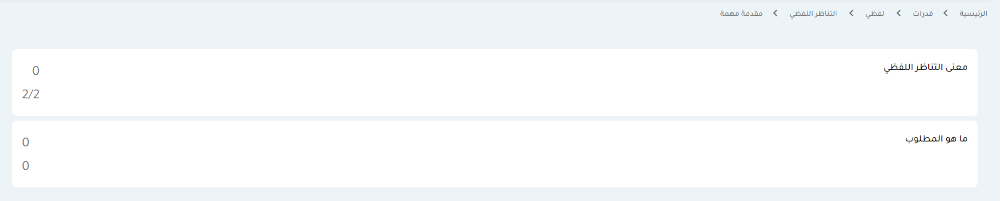

if the child has no children you should show a link to the attempts page


if the child has divisions you should display them
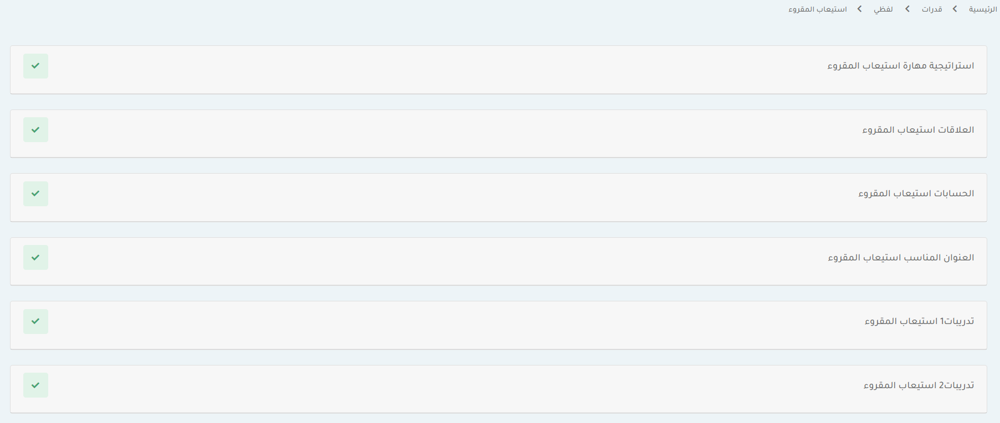

example of a child that has divisions is `category_id` = 76

```json
{
  "status": 200,
  "code": 0,
  "locale": "ar",
  "message": "OK",
  "data": {
    "id": 76,
    "title": "استيعاب المقروء",
    "full_title": "قدرات / لفظي / استيعاب المقروء",
    "has_questions": true,
    "parents": [4, 45],
    "parent_titles": [
      {
        "id": 4,
        "title": "قدرات "
      },
      {
        "id": 45,
        "title": " لفظي "
      }
    ],
    "children": [],
    "divisions": [
      {
        "id": 30,
        "title": "استراتيجية مهارة استيعاب المقروء",
        "is_free": 0, //not available for unsubscribed users, if the value is 1 it would be available
        "type_id": 1,
        "type": "فيديو",
        "content": null,
        "image": null,
        "explanations": [
          //each explanation is a video that was done by a teacher
          {
            "id": 77,
            "title": null,
            "content": null,
            "image": null,
            "video": "ArSkDhkYOQ4", //youtube id
            "teacher": {
              "id": 16,
              "name": "محمد 7",
              "country": null
            },
            "type_id": 1,
            "type": "فيديو"
          },
          {
            "id": 84,
            "title": null,
            "content": null,
            "image": null,
            "video": "12GaQgsL4GQ",
            "teacher": {
              "id": 26,
              "name": "محمد 142", //teacher name
              "country": null
            },
            "type_id": 1,
            "type": "فيديو"
          }
        ],
        "progress": "100.00" //it is complete if the progress == 100
      }
      //... other divisions
    ],
    "division_completion": {
      "completed": 9,
      "total": 9
    },
    "question_completion": {
      "completed": 4,
      "total": 4
    }
  },
  "errors": null,
  "exception": null,
  "export": null
}
```

each division can have many explanations, each explanation is a video and has one teacher

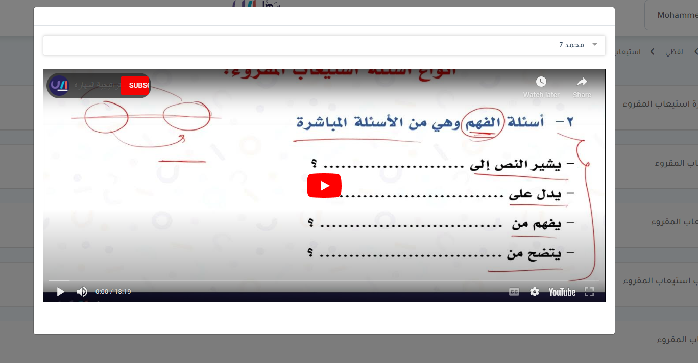

## samples

`GET` /api/members/samples

get all samples

### example response

```json
 "data": [
        {
            "id": 1,
            "title": "الاستثمار والأمطار الكونية",
            "is_free": 0, //same as divisions
            "sample_date": "2021-12-20",
            "percent": 98.7,
            "importance": null,
            "importance_id": 0,
            "progress_real": 0, //progress for اختبار حقيقي
            "progress_practice": 0 //progress for اختبار تجريبي
        },
        {
            "id": 68,
            "title": "1نموذج تجريبي",
            "is_free": 1,
            "sample_date": "2022-03-02",
            "percent": 100,
            "importance": "متوسط",
            "importance_id": 50,
            "progress_real": 0,
            "progress_practice": "100.00"
        }
 ]

```

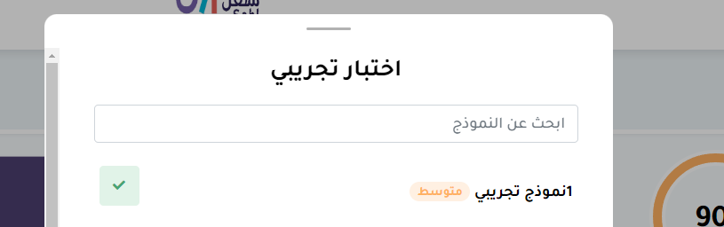
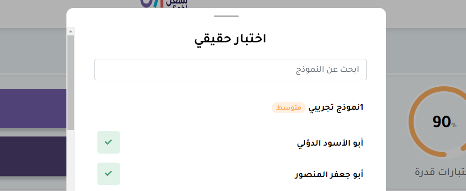

## create attempt

`POST` /api/members/attempts

creates an attempt (starts an exam)

### params

<table>
<tr>
<th>type</th>
<td>required, can be sample or category</td>
</tr>
<tr>
<th>sample_id</th>
<td>required if the type is sample</td>
</tr>
<tr>
<th>category_id</th>
<td>required if the type is category</td>
</tr>
<tr>
<th>is_real</th>
<td>required, set to 0 for now</td>
</tr>
<tr>
<th>category_type</th>
<td>required if type is sample,possible values: quantitative, verbal, both </td>
</tr>
</table>

### example response

```json
{
  "status": 200,
  "code": 0,
  "locale": "ar",
  "message": "OK",
  "data": {
    "id": 548,
    "attemptable": {
      "id": 68,
      "title": "1نموذج تجريبي",
      "is_free": 1,
      "sample_date": "2022-03-02",
      "percent": 100,
      "importance": "متوسط",
      "importance_id": 50,
      "progress_real": 0,
      "progress_practice": "100.00"
    },
    "attemptable_type": "sample",
    "allotted_time": 32,
    "result": "0%",
    "created_at": "2022-12-18T10:45:52.000000Z",
    "is_real": "1",
    "questions": [
      {
        "id": 2531,
        "text": "<p>سؤال ١</p>",
        "type_id": 3,
        "type_name": "اختر الاجابة",
        "difficulty_id": 1,
        "image": null,
        "image_position": null,
        "expl_video": null,
        "videos": [],
        "expl_image": null,
        "paragraph": {
          "id": 1,
          "title": "الاخطبوط تجميعات با بطين الفترة الأولى",
          "content": "<p style=\"text-align: right;\"><span class=\"fontstyle0\">أحد الحيوانات البحرية له ثمانية أذرع طويلة تتخذ هيئة لوامس مليئة بالماصات، ولدى ࢫهذا الحيوان آليات دفاعية بديله فهو قادر على اطلاق سحابة سوداء من الحبر تجاه مفترسه تعمل على ارباك العدو واعاقة حاسة البصر لديه لفترة من الوقت بحيث تكون كفيلة بإعطاء الآخطبوط فرصة للهروب ولافلات، إضافة الى ذلك يحتوي حبر الاخطبوط على مادة تؤثر بصورة مؤقته على حاسة الشم لدى عدوه ومن ثم يصبح من العسير اقتفاء أثره الى جانب ذلك فان الاخطبوط ي</span><span class=\"fontstyle0\">ستطيع السباحة بسرعة شديدة عند الاحساس بالخطر حتى انه قد يقوم بقطع احدى اذرعه أثناء عملية الهروب لتضليل العدو ثم ينمو له طرف بديل بشكل تدريجي. وتعيش أنواع الأخطبوط في جميع محيطات العالم، ولكنها تكثر اعدادا وتنوعا في البحار الدافئة ࢫحول خط الاستواء. وقد تتواجد قرب المياه الضحلة أحيانا أو ضمن عدة أمتار تحت سطح الماء ولكنها تميل للبقاء على مسافات بعيدة عن السطح ومن أنواعها أخطبوط المحيط الهادي العملاق<br />والاخطبوط القزم والاخطبوط الأزرق. كما يتميز بسرعة السباحة في المياه، وهوࢫ ستعمل اثنين فقط من أطرافه للحركة وباقي الأطراف يستخدمها للأكل، وذلك حسب الدراسات الحديثة، كما أنه يستطيع تغيير&nbsp; لونه ليناسب البيئة التي يختبئ بها في انتظار فرائسه التي تصبح عديمة القدرة عندما يمسك بها.</span></p>"
        },
        "section_title": "استيعاب المقروء",
        "answer": {
          "id": null,
          "answer": null
        },
        "correct_answer": {
          "id": 9681,
          "answer": "<p>١</p>",
          "correct": 1,
          "answer_data": null,
          "order": 3
        },
        "answers": [
          {
            "id": 9727,
            "answer": "<p>٠</p>",
            "correct": 0,
            "answer_data": null,
            "order": 5
          },
          {
            "id": 9681,
            "answer": "<p>١</p>",
            "correct": 1,
            "answer_data": null,
            "order": 3
          },
          {
            "id": 9682,
            "answer": "<p>٠</p>",
            "correct": 0,
            "answer_data": null,
            "order": 4
          },
          {
            "id": 9730,
            "answer": "<p>٠</p>",
            "correct": 0,
            "answer_data": null,
            "order": 8
          }
        ],
        "is_correct": null,
        "time_taken": "0:00",
        "used_help": null
      },
      {
        "id": 2532,
        "text": "<p>سؤال ٢</p>",
        "type_id": 3,
        "type_name": "اختر الاجابة",
        "difficulty_id": 1,
        "image": null,
        "image_position": null,
        "expl_video": null,
        "videos": [],
        "expl_image": null,
        "paragraph": null,
        "section_title": "إكمال الجمل",
        "answer": {
          "id": null,
          "answer": null
        },
        "correct_answer": {
          "id": 9684,
          "answer": "<p>١</p>",
          "correct": 1,
          "answer_data": null,
          "order": 2
        },
        "answers": [
          {
            "id": 9684,
            "answer": "<p>١</p>",
            "correct": 1,
            "answer_data": null,
            "order": 2
          },
          {
            "id": 9685,
            "answer": "<p>٠</p>",
            "correct": 0,
            "answer_data": null,
            "order": 3
          },
          {
            "id": 9686,
            "answer": "<p>١</p>",
            "correct": 0,
            "answer_data": null,
            "order": 4
          },
          {
            "id": 9683,
            "answer": "<p>٠</p>",
            "correct": 0,
            "answer_data": null,
            "order": 1
          }
        ],
        "is_correct": null,
        "time_taken": "0:00",
        "used_help": null
      },
      {
        "id": 2533,
        "text": "<p>سؤال ٣</p>",
        "type_id": 3,
        "type_name": "اختر الاجابة",
        "difficulty_id": 1,
        "image": null,
        "image_position": null,
        "expl_video": "WaLvWE3B4O0",
        "videos": [
          {
            "id": 27,
            "video": "WaLvWE3B4O0",
            "type": 1,
            "teacher_id": 18,
            "question_id": 0,
            "deleted_at": null,
            "created_at": "2022-12-05T16:19:50.000000Z",
            "updated_at": "2022-12-05T16:19:50.000000Z",
            "source_type": "App\\Models\\Question",
            "source_id": 2533
          }
        ],
        "expl_image": null,
        "paragraph": null,
        "section_title": null,
        "answer": {
          "id": null,
          "answer": null
        },
        "correct_answer": {
          "id": 9690,
          "answer": "<p>١</p>",
          "correct": 1,
          "answer_data": null,
          "order": 4
        },
        "answers": [
          {
            "id": 9689,
            "answer": "<p>٠</p>",
            "correct": 0,
            "answer_data": null,
            "order": 3
          },
          {
            "id": 9687,
            "answer": "<p>٠</p>",
            "correct": 0,
            "answer_data": null,
            "order": 1
          },
          {
            "id": 9690,
            "answer": "<p>١</p>",
            "correct": 1,
            "answer_data": null,
            "order": 4
          },
          {
            "id": 9688,
            "answer": "<p>٠</p>",
            "correct": 0,
            "answer_data": null,
            "order": 2
          }
        ],
        "is_correct": null,
        "time_taken": "0:00",
        "used_help": null
      },
      {
        "id": 2540,
        "text": "<p>سؤال ١٠</p>",
        "type_id": 3,
        "type_name": "اختر الاجابة",
        "difficulty_id": 1,
        "image": null,
        "image_position": null,
        "expl_video": null,
        "videos": [],
        "expl_image": null,
        "paragraph": {
          "id": 1,
          "title": "الاخطبوط تجميعات با بطين الفترة الأولى",
          "content": "<p style=\"text-align: right;\"><span class=\"fontstyle0\">أحد الحيوانات البحرية له ثمانية أذرع طويلة تتخذ هيئة لوامس مليئة بالماصات، ولدى ࢫهذا الحيوان آليات دفاعية بديله فهو قادر على اطلاق سحابة سوداء من الحبر تجاه مفترسه تعمل على ارباك العدو واعاقة حاسة البصر لديه لفترة من الوقت بحيث تكون كفيلة بإعطاء الآخطبوط فرصة للهروب ولافلات، إضافة الى ذلك يحتوي حبر الاخطبوط على مادة تؤثر بصورة مؤقته على حاسة الشم لدى عدوه ومن ثم يصبح من العسير اقتفاء أثره الى جانب ذلك فان الاخطبوط ي</span><span class=\"fontstyle0\">ستطيع السباحة بسرعة شديدة عند الاحساس بالخطر حتى انه قد يقوم بقطع احدى اذرعه أثناء عملية الهروب لتضليل العدو ثم ينمو له طرف بديل بشكل تدريجي. وتعيش أنواع الأخطبوط في جميع محيطات العالم، ولكنها تكثر اعدادا وتنوعا في البحار الدافئة ࢫحول خط الاستواء. وقد تتواجد قرب المياه الضحلة أحيانا أو ضمن عدة أمتار تحت سطح الماء ولكنها تميل للبقاء على مسافات بعيدة عن السطح ومن أنواعها أخطبوط المحيط الهادي العملاق<br />والاخطبوط القزم والاخطبوط الأزرق. كما يتميز بسرعة السباحة في المياه، وهوࢫ ستعمل اثنين فقط من أطرافه للحركة وباقي الأطراف يستخدمها للأكل، وذلك حسب الدراسات الحديثة، كما أنه يستطيع تغيير&nbsp; لونه ليناسب البيئة التي يختبئ بها في انتظار فرائسه التي تصبح عديمة القدرة عندما يمسك بها.</span></p>"
        },
        "section_title": "استيعاب المقروء",
        "answer": {
          "id": null,
          "answer": null
        },
        "correct_answer": {
          "id": 9718,
          "answer": "<p>١</p>",
          "correct": 1,
          "answer_data": null,
          "order": 4
        },
        "answers": [
          {
            "id": 9718,
            "answer": "<p>١</p>",
            "correct": 1,
            "answer_data": null,
            "order": 4
          },
          {
            "id": 9716,
            "answer": "<p>٠</p>",
            "correct": 0,
            "answer_data": null,
            "order": 2
          },
          {
            "id": 9715,
            "answer": "<p>٠</p>",
            "correct": 0,
            "answer_data": null,
            "order": 1
          },
          {
            "id": 9717,
            "answer": "<p>٠</p>",
            "correct": 0,
            "answer_data": null,
            "order": 3
          }
        ],
        "is_correct": null,
        "time_taken": "0:00",
        "used_help": null
      },
      {
        "id": 2541,
        "text": "<p>سؤال ١١&nbsp;<math dir=\"rtl\"\r\n             xmlns=\"http://www.w3.org/1998/Math/MathML\"\r\n             style=\"font-size: 20px;font-family:arial\">\r\n             <mstyle fontfamily=\"arial\" displaystyle=\"true\" mathcolor=\"#000000\" ><msqrt><mfrac bevelled=\"true\"><mi>&#1589;</mi><msup><mi>&#1587;</mi><mn>٢</mn></msup></mfrac></msqrt></mstyle>\r\n             </math></p>",
        "type_id": 3,
        "type_name": "اختر الاجابة",
        "difficulty_id": 1,
        "image": null,
        "image_position": null,
        "expl_video": "iHYVL-Wu6LQ",
        "videos": [
          {
            "id": 5,
            "video": "iHYVL-Wu6LQ",
            "type": 1,
            "teacher_id": 18,
            "question_id": 2541,
            "deleted_at": null,
            "created_at": "2022-08-03T17:53:02.000000Z",
            "updated_at": "2022-08-03T17:53:02.000000Z",
            "source_type": "App\\Models\\Question",
            "source_id": 2541
          },
          {
            "id": 6,
            "video": "KpbDiZLBGs8",
            "type": 1,
            "teacher_id": 26,
            "question_id": 2541,
            "deleted_at": null,
            "created_at": "2022-08-28T20:25:39.000000Z",
            "updated_at": "2022-08-28T20:25:39.000000Z",
            "source_type": "App\\Models\\Question",
            "source_id": 2541
          }
        ],
        "expl_image": null,
        "paragraph": {
          "id": 1,
          "title": "الاخطبوط تجميعات با بطين الفترة الأولى",
          "content": "<p style=\"text-align: right;\"><span class=\"fontstyle0\">أحد الحيوانات البحرية له ثمانية أذرع طويلة تتخذ هيئة لوامس مليئة بالماصات، ولدى ࢫهذا الحيوان آليات دفاعية بديله فهو قادر على اطلاق سحابة سوداء من الحبر تجاه مفترسه تعمل على ارباك العدو واعاقة حاسة البصر لديه لفترة من الوقت بحيث تكون كفيلة بإعطاء الآخطبوط فرصة للهروب ولافلات، إضافة الى ذلك يحتوي حبر الاخطبوط على مادة تؤثر بصورة مؤقته على حاسة الشم لدى عدوه ومن ثم يصبح من العسير اقتفاء أثره الى جانب ذلك فان الاخطبوط ي</span><span class=\"fontstyle0\">ستطيع السباحة بسرعة شديدة عند الاحساس بالخطر حتى انه قد يقوم بقطع احدى اذرعه أثناء عملية الهروب لتضليل العدو ثم ينمو له طرف بديل بشكل تدريجي. وتعيش أنواع الأخطبوط في جميع محيطات العالم، ولكنها تكثر اعدادا وتنوعا في البحار الدافئة ࢫحول خط الاستواء. وقد تتواجد قرب المياه الضحلة أحيانا أو ضمن عدة أمتار تحت سطح الماء ولكنها تميل للبقاء على مسافات بعيدة عن السطح ومن أنواعها أخطبوط المحيط الهادي العملاق<br />والاخطبوط القزم والاخطبوط الأزرق. كما يتميز بسرعة السباحة في المياه، وهوࢫ ستعمل اثنين فقط من أطرافه للحركة وباقي الأطراف يستخدمها للأكل، وذلك حسب الدراسات الحديثة، كما أنه يستطيع تغيير&nbsp; لونه ليناسب البيئة التي يختبئ بها في انتظار فرائسه التي تصبح عديمة القدرة عندما يمسك بها.</span></p>"
        },
        "section_title": "التناظر اللفظي",
        "answer": {
          "id": null,
          "answer": null
        },
        "correct_answer": {
          "id": 9784,
          "answer": "<p>كرة: ملعب</p>",
          "correct": 1,
          "answer_data": null,
          "order": 1
        },
        "answers": [
          {
            "id": 9774,
            "answer": "<p><span >جندي : مناوبة</span></p>",
            "correct": 0,
            "answer_data": null,
            "order": 2
          },
          {
            "id": 9784,
            "answer": "<p>كرة: ملعب</p>",
            "correct": 1,
            "answer_data": null,
            "order": 1
          },
          {
            "id": 9776,
            "answer": "<p>٤</p>",
            "correct": 0,
            "answer_data": null,
            "order": 5
          },
          {
            "id": 9775,
            "answer": "<p>٣</p>",
            "correct": 0,
            "answer_data": null,
            "order": 3
          }
        ],
        "is_correct": null,
        "time_taken": "0:00",
        "used_help": null
      }
    ]
  },
  "errors": null,
  "exception": null,
  "export": null
}
```

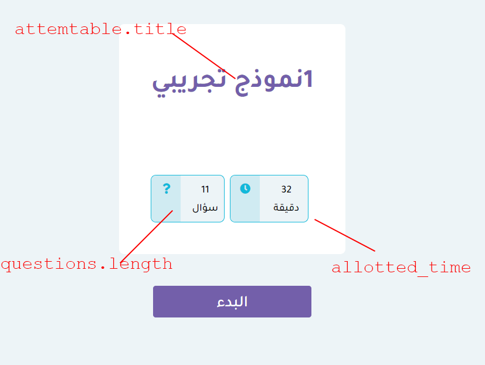

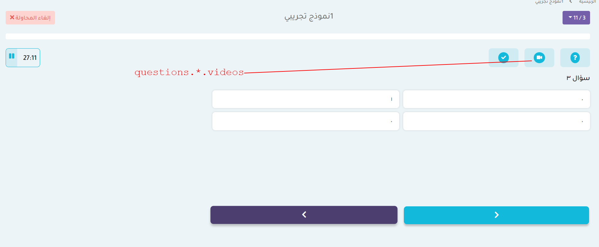

## answer attempt

`POST` /api/members/attempts/`{attempt_id}`

sends the attempt answers

### params

```json
{
  "_method": "patch",
  "answers": [
    {
      "question_id": 1547,
      "answer_id": 5160,
      "time_taken": 123, // in seconds
      "used_help": 0 // should be 1 if the user showed the answer or opened one of the videos
    }
    //... all other questions
  ]
}
```

## save data

`POST` /api/members/attempts/`{attempt_id}`/saveData

saves attempt data without finishing it so it can be retrieved later using `get previous attempt`

this must be called once when the attempt is started.

### params

```json
{
  "answers": [
    {
      "question_id": 1547,
      "answer_id": 5160,
      "time_taken": 123, // in seconds
      "used_help": 0 // should be 1 if the user showed the answer or opened one of the videos
    }
    //... all other questions
  ],
  "time_left": 20 //in seconds
}
```

## get previous attempt

`GET` /api/members/attempts/getPreviousAttempt

if the user leaves in the middle of an attempt, you can use this to retrive it the next time they attempt the same attemptable.

<table>
<tr>
<th>type</th>
<td>required,possible values: category, sample </td>
</tr>
<tr>
<th>sample_id</th>
<td>required if the type is sample</td>
</tr>
<tr>
<th>category_id</th>
<td>required if the type is category</td>
</tr>
<tr>
<th>is_real</th>
<td>required, set to 0 for now</td>
</tr>
<tr>
<th>category_type</th>
<td>required if type is sample,possible values: quantitative, verbal, both </td>
</tr>
</table>

### example response

if there is a previous attempt,
the response is the exact same as the request sent in `answer attempt` and `save data`.
if there is not previous attempt it returns a `404`

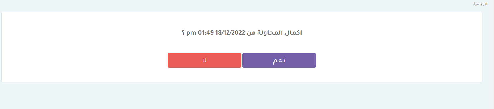

## cancel attempt

`POST` /api/members/attempts/538/cancel

when the user is given the choice to continue the previous attempt and they choose no, this request should be called so the attempt will not be shown again next time `get previous attempt` is called

## complete

`POST` /api/members/complete

used to mark someting as completed, it can be a question or a division

### params

<table>
<tr>
<th>completable_type</th>
<td>required,possible values: App\Models\Explanation</td>
</tr>
<tr>
<th>completable_id</th>
<td>required</td>
</tr>
</table>

explanation: completed after a video is watched

## search

`GET` /api/members/search


used to search for a question 

### params

<table>
<tr>
<th>query</th>
<td>required</td>
</tr>
</table>

## get user

`GET` /api/members/user

used to get user info and subscription info
the subscription id returned from this request will be used in the cancel subsciptions request

## logout other sessions

`POST` /api/members/logoutOtherSessions

used to logout all sessions other than the one chosen by the user. use this when a warning is returned from any reuqest.

### params

<table>
<tr>
<th>session_id</th>
<td>required, the session id we DONT want to logout from</td>
</tr>
</table>

## cancel subscrtiption

`POST` /api/members/subscriptions/{id}/cancel

used to cancel the subscription, use the subscription id that is returned from the get user request


